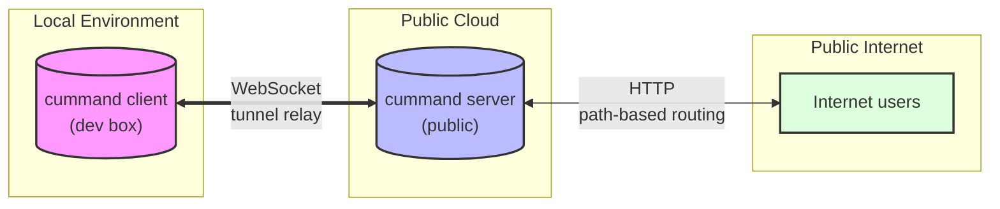

# cummand

A lightweight CLI tool that securely tunnels your local development servers to the public internet using custom, memorable aliases.

## Quick Start

```bash
# Ad-hoc mode (no config needed)
cummand start http://localhost:3000

# Profile mode (uses saved config)
cummand start --alias frontend
```

## Installation

```bash
pip install cummand   # (once published)
# or from source:
uv pip install -e .
```

## CLI Reference

### `cummand start`

Start a tunnel to expose a local server.

```bash
cummand start [URL] [--alias NAME] [--server URL] [--log-level LEVEL] [--retry-limit N]
```

**Ad-hoc mode:** Pass a URL directly.

```bash
cummand start http://localhost:3000
```

**Profile mode:** Use a saved alias from config.

```bash
cummand start --alias frontend
```

**Options:**

| Option                | Description                             |
| --------------------- | --------------------------------------- |
| `--alias`, `-a`       | Profile alias from config               |
| `--server`, `-s`      | Relay server URL (default: from config) |
| `--log-level`, `-l`   | `debug` or `info`                       |
| `--retry-limit`, `-r` | Max reconnection attempts               |

### `cummand config`

Manage configuration profiles.

```bash
cummand config list
cummand config add --alias NAME --url URL [--desc DESCRIPTION]
cummand config remove --alias NAME
cummand config set [--auth-token KEY] [--log-level LEVEL] [--auto-open BOOL] [--retry-limit N] [--server URL]
```

### `cummand server start`

Start the relay server.

```bash
cummand server start [--port PORT] [--ws-port PORT] [--auth-token TOKEN] [--log-level LEVEL]
```

## Configuration

Create a `cummand.config.toml` in your project root:

```toml
[defaults]
server_url = "ws://localhost:8765"
auto-open = true
log-level = "info"
retry-limit = 5

[auth]
token = ""

[alias.frontend]
url = "http://localhost:3000"
description = "Main Next.js app"

[alias.backend]
url = "http://localhost:8000"
description = "Python FastAPI service"
```

## Architecture



Each tunnel gets a unique 4-word code (e.g. `crimson-swift-falcon-river`). The server routes incoming requests by code prefix:

```bash
https://server.com/crimson-swift-falcon-river      → localhost:3000/
https://server.com/crimson-swift-falcon-river/about → localhost:3000/about
```

## Development

```bash
uv pip install -e .
cummand server start    # start relay server
cummand start http://localhost:3000  # start client tunnel
```
