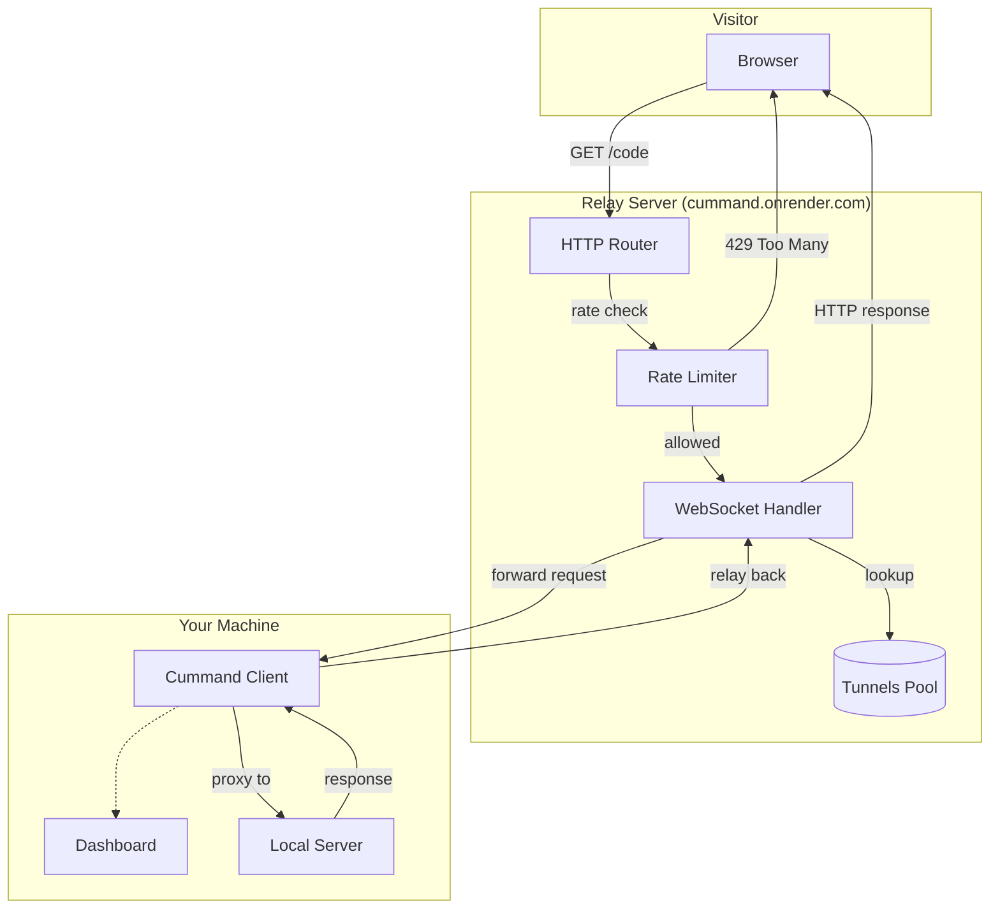

<p align="center">
A lightweight CLI tool that securely <code>tunnels</code> your local development servers to the public <code>internet</code> using custom, memorable <code>aliases</code>.
<br><br>

</p>
<br>

> [!IMPORTANT]\
> The public `cummand` relay server at `cummand.onrender.com` is **free and open** for everyone. No auth token required — just use it. See [Quick Start](#quick-start) to get started in seconds.

<br>

## Table of Contents

- [Features](#features)
- [Installation](#installation)
- [Quick Start](#quick-start)
- [How It Works](#how-it-works)
- [Development Setup](#development-setup)

## Features

- **Free public relay** — no account, no setup, no API key needed
- **Tunnel any local server** — expose `localhost:3000`, `localhost:5173`, or any port
- **Live dashboard** — real-time stats: requests, data, latency, uptime
- **4-word codes** — each tunnel gets a unique `color-adjective-animal-noun` (100M combos)
- **Custom aliases** — save frequently used tunnels as named profiles
- **Self-hostable** — deploy your own relay server on Render, VPS, or any cloud
- **Rate limited** — IP throttling and global tunnel cap prevent abuse

## Installation

### Global Install (recommended)

```bash
git clone https://github.com/divyanshudhruv/cummand.git
cd cummand
pip install .
```

Create a global config so `--global` / `-g` works everywhere:

```bash
cummand config init --global
```

Now `cummand tunnel` from any directory automatically uses the public relay. The config lives at `~/.cummand/cummand.config.toml`.

### Development

See [CONTRIBUTING.md](CONTRIBUTING.md).

## Quick Start

After installing, expose your local dev server in one command:

```bash
cummand tunnel http://localhost:3000
```

Your terminal shows a live dashboard:

| Field      | What it shows                                             |
| ---------- | --------------------------------------------------------- |
| Tunnel URL | `https://cummand.onrender.com/crimson-swift-falcon-river` |
| Status     | Online / Offline                                          |
| Requests   | Total request count                                       |
| Data       | Bytes sent through the tunnel                             |
| Latency    | Round-trip time in ms                                     |
| Uptime     | How long the tunnel has been active                       |

Share the **Tunnel URL** with anyone — they'll see your local app.

To stop, press `Ctrl+C`.

### Commands Overview

| Command                                         | What it does                                  |
| ----------------------------------------------- | --------------------------------------------- |
| `cummand tunnel <url>`                          | Connect your local server to the public relay |
| `cummand tunnel --alias <name>`                 | Use a saved alias from config                 |
| `cummand serve`                                 | Start your own relay server (self-hosting)    |
| `cummand serve --tunnel <url>`                  | Run relay server + tunnel in one terminal     |
| `cummand config init --global`                  | Create a global config file                   |
| `cummand config set <key> <value>`              | Change a config option                        |
| `cummand config add --alias <name> --url <url>` | Save a tunnel alias                           |

---

For full details, see:

- **[CLI Reference](docs/cli.md)** — all commands, options, and examples
- **[Configuration](docs/configuration.md)** — config file reference and advanced setup
- **[Self-Hosting](docs/README.md#self-hosting)** — deploy your own relay server

## How It Works

1. You run `cummand tunnel http://localhost:3000` — client opens a WebSocket to the relay
2. The server assigns a unique 4-word code like `crimson-swift-falcon-river`
3. A visitor hits `https://cummand.onrender.com/crimson-swift-falcon-river`
4. The server checks the **rate limiter** (max 5 WebSocket connects/min per IP, max 500 tunnels globally)
5. If allowed, the relay forwards the HTTP request through the WebSocket tunnel
6. Your local client proxies it to `localhost:3000` and sends the response back

```bash
https://cummand.onrender.com/crimson-swift-falcon-river      → localhost:3000/
https://cummand.onrender.com/crimson-swift-falcon-river/about → localhost:3000/about
```



## Development Setup

```bash
git clone https://github.com/divyanshudhruv/cummand.git
cd cummand

python -m venv .venv
# Windows: .venv\Scripts\activate
# macOS/Linux: source .venv/bin/activate

pip install -e ".[dev]"
```

Then run tests:

```bash
python -m pytest tests/ -v
```

Available `make` targets (Unix/macOS/WSL):

| Target  | Description                    |
| ------- | ------------------------------ |
| `dev`   | Editable install with dev deps |
| `test`  | Run test suite                 |
| `clean` | Remove build artifacts         |
