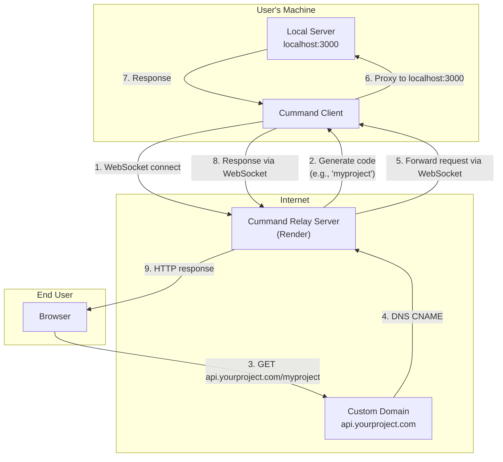

<p align="center">  
A lightweight CLI tool that securely <code>tunnels</code> your local development servers to the public <code>internet</code> using custom, memorable <code>aliases</code>.
<br><br>

</p>
<br>

> [!IMPORTANT]\
> The public `cummand` relay server requires a route password for access and is `not` currently available for global/unauthenticated deployment. To use `cummand`, you must run your own relay server `locally` or on your own `infrastructure`. See the docs for `self-hosting` instructions.

<br>

## Installation

> For **USAGE** (using the tool), run the install script below which removes non-required files (`public/`, `tests/`).

> For **DEVELOPMENT** (contribute or modify), skip the script and install normally.

### Usage (production)

```bash
git clone https://github.com/yourusername/cummand.git
cd cummand

# Removes dev-only directories, then installs
bash scripts/install.sh

# Or manually:
# rm -rf public tests
# pip install -e .
```

### Development

```bash
git clone https://github.com/yourusername/cummand.git
cd cummand

# Create and activate virtual environment (recommended)
python -m venv .venv

# Windows:
.venv\Scripts\activate

# macOS/Linux:
#source .venv/bin/activate

# Install in editable mode
pip install -e .

# Or with uv (faster):
uv sync
```

## Quick Start

```bash
# Ad-hoc mode (no config needed)
cummand start http://localhost:3000

# Profile mode (uses saved config)
cummand start --alias frontend
```

## CLI Reference

### `cummand start`

Start a tunnel to expose a local server.

```bash
cummand start [URL] [--alias NAME] [--server URL] [--auth-token KEY] [--log-level LEVEL] [--retry-limit N]
```

**Ad-hoc mode:** Pass a URL directly.

```bash
cummand start http://localhost:3000
```

**Profile mode:** Use a saved alias from config.

```bash
cummand start --alias frontend
```

**Options:**

| Option                 | Description                             |
| ---------------------- | --------------------------------------- |
| `--alias`, `-a`        | Profile alias from config               |
| `--server`, `-s`       | Relay server URL (default: from config) |
| `--auth-token`         | Auth token for relay server             |
| `--log-level`, `-l`    | `debug` or `info`                       |
| `--retry-limit`, `-r`  | Max reconnection attempts               |

### `cummand config`

Manage configuration profiles.

```bash
cummand config init [--global]
cummand config list
cummand config add --alias NAME --url URL [--desc DESCRIPTION]
cummand config remove --alias NAME
cummand config set [--auth-token KEY] [--log-level LEVEL] [--auto-open BOOL] [--retry-limit N] [--server URL]
```

### `cummand server start`

Start the relay server (HTTP + WebSocket on same port).

```bash
cummand server start [--port PORT] [--auth-token TOKEN] [--log-level LEVEL]
```

Settings also read from environment variables:

| Env Var              | Description                   |
| -------------------- | ----------------------------- |
| `PORT`               | Server port (default: `8080`) |
| `CUMMAND_AUTH_TOKEN` | Auth token for clients        |

## Configuration

Create a `cummand.config.toml` in your project root:

```toml
[defaults]
server_url = "ws://localhost:8080"
public_url = "http://{code}.localhost:8080"
auto-open = true
log-level = "info"
retry-limit = 5

[auth]
token = ""

[alias.frontend]
url = "http://localhost:3000"
description = "Main Next.js app"

[alias.backend]
url = "http://localhost:8000"
description = "Python FastAPI service"
```

## Architecture



Each tunnel gets a unique 4-word code (e.g. `crimson-swift-falcon-river`). The server routes incoming requests by code prefix:

```bash
https://server.com/crimson-swift-falcon-river      → localhost:3000/
https://server.com/crimson-swift-falcon-river/about → localhost:3000/about
```

## Self-Hosting (Deploy to Render)

Deploy your own relay server for production:

1. Push your repo to GitHub
2. On [Render](https://render.com) → **New Web Service** → connect your repo
3. Fill:

   | Field            | Value                            |
   | ---------------- | -------------------------------- |
   | Build Command    | `pip install -e .`               |
   | Start Command    | `cummand server start`           |
   | Plan             | Free or paid                     |

4. Add **Environment Variables**:

   | Key                  | Value                  |
   | -------------------- | ---------------------- |
   | `CUMMAND_AUTH_TOKEN` | `your-secret-token`    |
   | (`PORT` auto-set)    | `8080`                 |

5. Deploy → you get `https://your-app.onrender.com`

6. Update local config:

```bash
cummand config set --server wss://your-app.onrender.com
cummand config set --public-url https://your-app.onrender.com/{code}
cummand config set --auth-token your-secret-token
```

The server exposes a `/health` endpoint for Render health checks.

## Development Setup 

```bash
# Install (editable)
pip install -e .
# or: uv sync
# or: make dev

# Terminal 1: start relay server
cummand server start

# Terminal 2: start client tunnel
cummand start http://localhost:3000

# The dashboard shows live tunnel stats (uptime, requests, data, latency)
```

Available `make` targets:

| Target    | Description                        |
| --------- | ---------------------------------- |
| `install` | Production install via pip         |
| `dev`     | Editable install for development   |
| `clean`   | Remove dev files (public/, tests/) |
