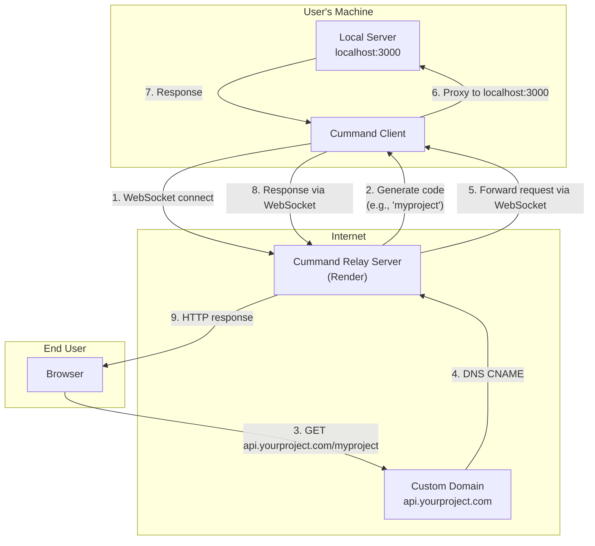

<p align="center">  
A lightweight CLI tool that securely <code>tunnels</code> your local development servers to the public <code>internet</code> using custom, memorable <code>aliases</code>.
<br><br>

</p>
<br>

> [!IMPORTANT]\
> The public `cummand` relay server requires a route password for access and is `not` currently available for global/unauthenticated deployment. To use `cummand`, you must run your own relay server `locally` or on your own `infrastructure`. See the docs for `self-hosting` instructions.

<br>

## Installation

> For **USAGE** (using the tool), run the install script below.

> For **DEVELOPMENT** (contribute or modify), install normally.

### Usage (production)

```bash
git clone https://github.com/divyanshudhruv/cummand.git
cd cummand

bash scripts/install.sh
```

### Development

```bash
git clone https://github.com/divyanshudhruv/cummand.git
cd cummand

# Create and activate virtual environment (recommended)
python -m venv .venv

# Windows:
.venv\Scripts\activate

# macOS/Linux:
#source .venv/bin/activate

# Install in editable mode
pip install -e .

# Or with uv (faster):
uv sync
```

## Quick Start

Choose the mode that fits your workflow:

### Single-Terminal Mode (local development — recommended)

Runs the relay server and tunnel client **in one process**. Your local app is tunneled automatically.

```bash
cummand serve --tunnel http://localhost:3000
```

That's it — one command, one terminal. Useful when you're developing locally and want everything running together.

### Two-Terminal Mode (self-hosting)

Server and client in separate terminals. Useful when you want to restart the client without stopping the server, or when they run on different machines.

```bash
# Terminal 1: relay server
cummand serve

# Terminal 2: tunnel client
cummand tunnel http://localhost:3000
```

### Connect to an External Relay

If the server is deployed elsewhere (Render, VPS, etc.):

```bash
cummand tunnel http://localhost:3000 --server wss://relay.example.com
```

### Profile Mode (saved alias from config)

```bash
cummand tunnel --alias frontend
```

## CLI Reference

### `cummand tunnel`

Start a tunnel to expose a local server.

```bash
cummand tunnel [URL] [--alias NAME] [--server URL] [--auth-token KEY] [--log-level LEVEL] [--retry-limit N] [--global]
```

| Option          | Shorthand | Description                         |
| --------------- | --------- | ----------------------------------- |
| `--alias`       | `-a`      | Use a saved alias profile           |
| `--server`      | `-s`      | Relay server URL (overrides config) |
| `--auth-token`  |           | Auth token for relay server         |
| `--log-level`   | `-l`      | `debug` or `info`                   |
| `--retry-limit` | `-r`      | Max reconnection attempts           |
| `--global`      | `-g`      | Use global config (`~/.cummand/`)   |

### `cummand serve`

Start the relay server — optionally with a built-in tunnel.

```bash
cummand serve [--port PORT] [--auth-token TOKEN] [--tunnel URL] [--log-level LEVEL]
```

| Option         | Shorthand | Description                                    |
| -------------- | --------- | ---------------------------------------------- |
| `--port`       | `-p`      | Port to listen on (default: `8080`)            |
| `--auth-token` |           | Require auth token from clients                |
| `--tunnel`     | `-t`      | Also tunnel a local URL (single-terminal mode) |
| `--log-level`  | `-l`      | Log level: `debug` or `info`                   |

Settings also read from environment variables:

| Env Var              | Description                   |
| -------------------- | ----------------------------- |
| `PORT`               | Server port (default: `8080`) |
| `CUMMAND_AUTH_TOKEN` | Auth token for clients        |

### `cummand config`

Manage configuration profiles.

```bash
cummand config init [--global|-g]
cummand config list [--global|-g]
cummand config add --alias NAME --url URL [--desc DESC] [--global|-g]
cummand config remove --alias NAME [--global|-g]
cummand config set <key> <value> [--global|-g]
```

All config commands support `--global` / `-g` to target `~/.cummand/` instead of the local directory.

Global options available on all commands: `--version` / `-V` to show version and exit.

## Configuration

Create a `cummand.config.toml` in your project root:

```toml
[defaults]
server-url = "ws://localhost:8080"
public-url = "http://{code}.localhost:8080"
auto-open = true
log-level = "info"
retry-limit = 5

[auth]
token = ""

[alias.frontend]
url = "http://localhost:3000"
description = "Main Next.js app"

[alias.backend]
url = "http://localhost:8000"
description = "Python FastAPI service"
```

## Architecture



Each tunnel gets a unique 4-word code (e.g. `crimson-swift-falcon-river`). The server routes incoming requests by code prefix:

```bash
https://server.com/crimson-swift-falcon-river      → localhost:3000/
https://server.com/crimson-swift-falcon-river/about → localhost:3000/about
```

## Self-Hosting (Deploy to Render)

Deploy your own relay server for production:

1. Push your repo to GitHub
2. On [Render](https://render.com) → **New Web Service** → connect your repo
3. Fill:

   | Field         | Value              |
   | ------------- | ------------------ |
   | Build Command | `pip install -e .` |
   | Start Command | `cummand serve`    |
   | Plan          | Free or paid       |

4. Add **Environment Variables**:

   | Key                  | Value               |
   | -------------------- | ------------------- |
   | `CUMMAND_AUTH_TOKEN` | `your-secret-token` |
   | (`PORT` auto-set)    | `8080`              |

5. Deploy → you get `https://your-app.onrender.com`

6. Update local config:

```bash
cummand config set server-url wss://your-app.onrender.com
cummand config set public-url https://your-app.onrender.com/{code}
cummand config set auth-token your-secret-token
```

The server exposes a `/health` endpoint for Render health checks.

## Development Setup

```bash
# Install (editable)
pip install -e .
# or: uv sync
# or: make dev

# Single terminal: relay server + tunnel client together
cummand serve --tunnel http://localhost:3000

# Or two terminals:
# Terminal 1: cummand serve
# Terminal 2: cummand tunnel http://localhost:3000

# The dashboard shows live tunnel stats (uptime, requests, data, latency)
```

Available `make` targets (Unix/macOS/WSL):

| Target    | Description                                      |
| --------- | ------------------------------------------------ |
| `install` | Production install via pip                       |
| `dev`     | Editable install for development                 |
| `test`    | Run the test suite                               |
| `clean`   | Remove build artifacts (egg-info, __pycache__)   |

On Windows, run the commands directly:
- `pip install -e .`
- `pip install -e ".[dev]"`
- `python -m pytest tests/ -v`
